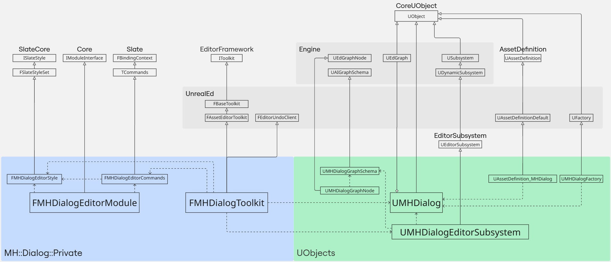

# UE5 Dialogue System  plugin

This plugin is created as a sample of custom editor for the Unreal Engine 5.6. It contains a dialogue asset that can be created using the context menu and a graph editor, similar to the environment query system editor.

As educational project the plugin has a UML diagram relevant to each set of classes in each commit. So you can check all changes to the class set since the initial commit.

* The plugin is written in compliance with [UE Coding Standard](https://dev.epicgames.com/documentation/en-us/unreal-engine/epic-cplusplus-coding-standard-for-unreal-engine#namespaces)
* Instead of the outdated Asset Actions (FAssetTypeActions_Base), a new mechanism for registering assets via Asset Definitions (UAssetDefinitionDefault) is used.
* One of the basic principles of programming says - [prefer composition to inheritance](https://en.wikipedia.org/wiki/Composition_over_inheritance). So, where possible, heavyweight inheritance was avoided.
